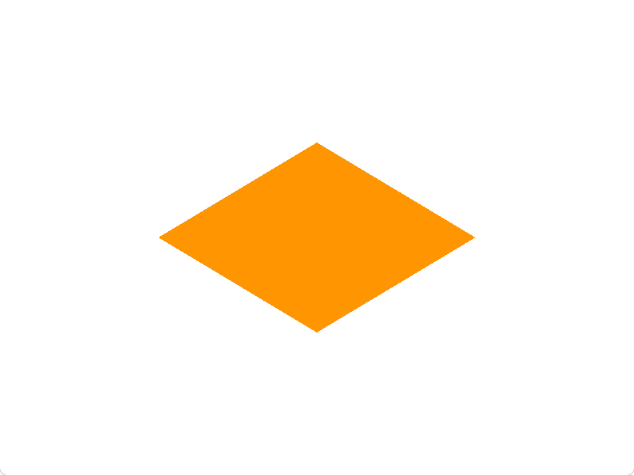

# Vertex

Vertexは日本語で「頂点」を意味する。
頂点をいくつか設け、頂点間を塗りつぶすのが最も一般的な描画のアプローチ。

このセクションでは、頂点を定義して色を塗ることで様々な形を描画してみる。

## 1. 三角形を描画しよう

`src/shader.wgsl`に以下のコードを貼り付ける。

```wgsl
@vertex
fn vs_main(@builtin(vertex_index) vertex_index: u32) -> @builtin(position) vec4f {
    let positions = array<vec4f, 3>(
        vec4f(0.0, 0.5, 0.0, 1.0),
        vec4f(0.5, -0.5, 0.0, 1.0),
        vec4f(-0.5, -0.5, 0.0, 1.0),
    );

    return positions[vertex_index];
}

@fragment
fn fs_main() -> @location(0) vec4f {
    return vec4f(0.0);
}
```

そして、ルートで以下のコマンドを実行する。

```bash
cargo run -p vertex --release
```

ビルド終了後、ウィンドウが表示され、そこに真っ黒の三角形が描画されることを確認できるはず。

コードを見てみる。

### コード解説

#### 1. Vertex Shader

```wgsl
@vertex
fn vs_main(@builtin(vertex_index) vertex_index: u32) -> @builtin(position) vec4f {}
```

- `@vertex`: 「以下の関数は頂点全員分走らせるエントリーポイント(バーテックスシェーダー)だよ」という指定。
- `fn`: 関数宣言のためのキーワード。
- `@builtin()`: WGSLが設けた変数を使うため。
- `@builtin(vertex_index)`: 頂点の数の分をインデックスとして取得できる。
- `u32`: 符号なし32ビット整数型
- `->`: その関数の戻り値の型を明示するため。
- `@builtin(position)`: 後述の色塗りのための`@fragment`が頂点の座標として認識できるようにラベルをつける。
- `vec4f`: 4次元($X, Y, Z, W$)の`f32`(32ビット浮動小数点数)型。`vec4<f32>`とも書ける。

#### 2. 頂点定義部分

三角形になるように頂点を定義しています。

```wgsl
let positions = array<vec4f, 3>(
    vec4f(0.0, 0.5, 0.0, 1.0),
    vec4f(-0.5, -0.5, 0.0, 1.0),
    vec4f(0.5, -0.5, 0.0, 1.0),
);
return positions[vertex_index];
```

- `let`: 不変変数宣言
- `array<vec4f, 3>`: 3つの`vec4f`が入った配列型
- `return`: 値を変えす

上から、

1. `vec4f(0.0, 0.5, 0.0, 1.0)`で三角形の上
2. `vec4f(-0.5, -0.5, 0.0, 1.0)`で左下
3. `vec4f(0.5, -0.5, 0.0, 1.0)`で右下

に頂点を打っている。

> 3つめと4つめの値は今は無視

ここで大事なのは、左回りに点を返してること。
Rust側で、左回りを指定してるため。(CCWというグラフィックスの一般的な方式)。
もし右回りにすると、裏向きと判定されて自動で描画をスキップされてしまう(カリング)。

#### 3. Fragment Shader

今回のセクションでは深掘りしないが、「フラグメント」は、**頂点間の各ピクセル(厳密には違うかもしれない)**。
なので、すべての頂点間のピクセルに対してこれが走る。
ちなみに、`main.rs`では、「頂点3つの間を埋める」ように設定しているので、三角形ができる。設定によっては、頂点間に線を引くだけで内側は塗りつぶさないようにもできる。

```wgsl
@fragment
fn fs_main() -> @location(0) vec4f {
    return vec4f(0.0);
}
```

- `@fragment`: 「以下の関数はフラグメントに走らせるエントリーポイント(フラグメントシェーダー)だよ」
- `location(0)`: wgpu(Rust側)がかかわるので一旦無視してOK。ただ必須。
- `vec4f(0.0)`: `vec4f(0.0, 0.0, 0.0, 0.0)`と同じ。なので黒色。

この場合戻り値は色。

## 2. 四角形を描画しよう

四角形を描画するにはどうしたらいいか？
単純に考えれば、左上、左下、右下、右上に頂点を配置すればいい。

実際にやってみてほしい。`position`を以下の様に変更

```wgsl
let positions = array<vec4f, 4>(
    vec4f(-0.5, 0.5, 0.0, 1.0),
    vec4f(-0.5, -0.5, 0.0, 1.0),
    vec4f(0.5, -0.5, 0.0, 1.0),
    vec4f(0.5, 0.5, 0.0, 1.0),
);
```

結果は左下が直角な三角形になる。理由は、フラグメントのところでも書いた通り、「3つで1つ」だから。
つまり、四角形を描画するには三角形を2つ作る必要がある。

なので、

```wgsl
let positions = array<vec4f, 6>(
    // 一つ目の三角形
    vec4f(-0.5, 0.5, 0.0, 1.0),  // 左上
    vec4f(-0.5, -0.5, 0.0, 1.0), // 左下
    vec4f(0.5, -0.5, 0.0, 1.0),  // 右下

    // 二つ目の三角形
    vec4f(0.5, -0.5, 0.0, 1.0), // 右下
    vec4f(0.5, 0.5, 0.0, 1.0),  // 右上
    vec4f(-0.5, 0.5, 0.0, 1.0), // 左上
);
```

これで完璧なはず。

と、思いきや結果は変わらない。
なぜなら、`vs_main`の引数、`vetex_index`はRust側の設定で0~2の3つしか流れてこないから。

`src/main.rs`の上部、`NUM_VERTICES`の値を3から6へ変更してみてほしい。


これで完璧な四角形が描画された。

## 3. チャンレンジ

オレンジ色のひし形(🔶)を表示してください。

**ヒント**:

フラグメントの戻り値`vec4f`は、それぞれこのようになっている。

`vec4f(赤成分, 緑成分, 青成分, 透明度)`

> それぞれ`0.0`~`1.0`

オレンジ色は、赤を全開に、緑をいくつか混ぜればつくれる。

**完成形の例**:

