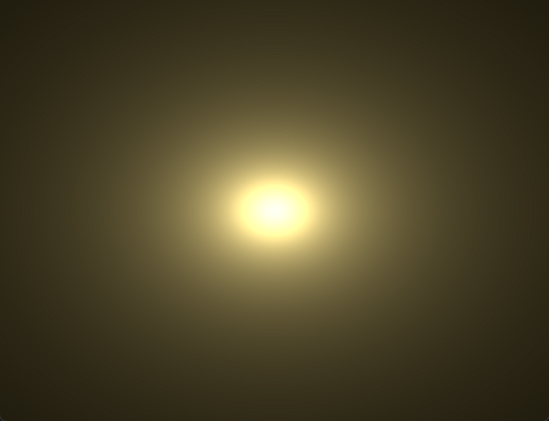

# Fragment

前章で触れた通り、フラグメントはピクセルごとの色的なもの。

最初に、面白い現象(仕様)を見せたい。

以下のコードを`src/shader.wgsl`に張り付ける

```wgsl
struct VertexOutput {
    @builtin(position) position: vec4f,
    @location(0) color: vec4f,
}

@vertex 
fn vs_main(@builtin(vertex_index) idx: u32) -> VertexOutput {
    var out: VertexOutput;

    let positions = array<vec2f, 3>(
        vec2f(0.0, 0.5),
        vec2f(-0.5, -0.5),
        vec2f(0.5, -0.5),
    );

    let colors = array<vec3f, 3>(
        vec3f(1.0, 0.0, 0.0),
        vec3f(0.0, 1.0, 0.0),
        vec3f(0.0, 0.0, 1.0),
    );

    out.position = vec4f(positions[idx], 0.0, 1.0);
    out.color = vec4f(colors[idx], 1.0);

    return out;
}

@fragment
fn fs_main(in: VertexOutput) -> @location(0) vec4f {
    return in.color;
}
```

> `var`は可変変数

実行すると、七色にグラデーションされた三角形が描画される。

ここで大事なのは、`in: VertexOutput`は、`vs_main`のリターンした値が直接入ってくるわけではないということ。
`vs_main`で`VertexOutput`に詰めたのは赤青緑の三択で、`fs_main`では`return in.color`とそのままだしているのに、明らかに赤青緑以外の色がでてる。
理由は**頂点をもとに線形補完している**から。ピクセル自体色と言うデータは持たないので、そうするしかない。

## 時間でカラフルを作ろう

`src/shader.wgsl`の上部に以下のコードを追加

```wgsl
struct Time {
    value: f32,
}

@group(0) @binding(0) var<uniform> time: Time;
```

CPU側(`main.rs`)で計測している経過時間が格納されます。
これをもとに動的にカラフルな画面を作ります。

`fs_main`の中身を以下で上書き

```wgsl
var color = in.color;

let s = abs(sin(time.value));

color.r = mix(color.r, color.g, s);
color.g = mix(color.g, color.b, s);
color.b = mix(color.b, color.r, s);

return color;
```

- `abs(n)`: nの絶対値を返す
- `sin(n)`: nをサインにかけた結果を返す
- `color.r`: ベクタの一つ目の値(`color.x`と書くことが多いと思うけど)
- `mix(a, b, t)`: aとbの間(tの部分)を返す
    `mix(0.0, 3.0, 0.5)` → `1.5`

実行すると、三角形が美しくカラフルに描画されるはず。

## UVを使おう

UVはポリゴン上の座標。UVを使うとより高度な表現ができる。
例えば四角形で画面全体を覆えば、フラグメントで自由自在に画面をデザインできる。やってみよう。

```wgsl
struct Time {
    value: f32,
}

@group(0) @binding(0) var<uniform> time: Time;

struct VertexOutput {
    @builtin(position) position: vec4f,
    @location(0) uv: vec2f,
}

@vertex 
fn vs_main(@builtin(vertex_index) idx: u32) -> VertexOutput {
    var out: VertexOutput;

    let positions = array<vec2f, 6>(
        vec2f(-1.0, 1.0),
        vec2f(-1.0, -1.0),
        vec2f(1.0, -1.0),

        vec2f(-1.0, 1.0),
        vec2f(1.0, -1.0),
        vec2f(1.0, 1.0),
    );

    // UV: 左上が原点、右下が1.0, 1.0
    let uvs = array<vec2f, 6>(
        vec2f(0.0, 0.0),
        vec2f(0.0, 1.0),
        vec2f(1.0, 1.0),

        vec2f(0.0, 0.0),
        vec2f(1.0, 1.0),
        vec2f(1.0, 0.0),
    );

    out.position = vec4f(positions[idx], 0.0, 1.0);
    out.uv = uvs[idx];

    return out;
}

@fragment
fn fs_main(in: VertexOutput) -> @location(0) vec4f {
    // 扱いやすいように中心をUVの原点にする
    let original_uv = in.uv;
    let uv = original_uv * 2.0 - vec2f(1.0, 1.0);

    let l = vec3f(length(uv));
    return vec4f(l, 1.0);
}
```

中心ほど黒く、外がは白くなった。美しい。

こういったコード、最初はマジで難解だった。
今思えば簡単。最初の虹色の三角形の例では、赤青緑の情報しか与えてないのに黄色や紫色など、それ以外の数万通りの色が出力される。
色は所詮数値。つまり数値が線形補完された結果の黄色や紫色などなので、純粋に数値として扱うこともできる。

シェーダーはコンソール出力などできないので、こういったものが独学だと理解しづらい。

## 太陽を作ろう

太陽は逆二乗の法則があてはまるので、光の強さを、光源からの距離の二乗分の1にしていけば現実的になる。

> ちなみに、今はアスペクト比を考慮していないのでウィンドウサイズの影響をもろに受ける。一旦放置。

フラグメントシェーダーを以下で上書きしてください

```wgsl
@fragment
fn fs_main(in: VertexOutput) -> @location(0) vec4f {
    let uv = in.uv * 2.0 - vec2f(1.0);
    
    let len = length(uv);

    // 太陽のベースの色
    let base_color = vec3f(1.0, 0.8, 0.3);

    // 逆二乗とゼロ除算対策(+0.01)
    let intensity = vec3f(0.03 / (len * len + 0.01));
    
    // ベースにかけ合わせる
    let final_color = base_color * intensity;

    return vec4f(final_color, 1.0);
}
```



太陽っぽいものができた。いろいろいじってみても面白い
