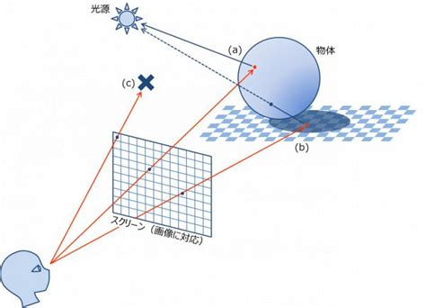

# レイマーチング

レイマーチングは、ポリゴンを一切使わずに空間を描画する手法で、2のfragmentを超応用したもの。

画面全体を三角形2つのポリゴンで覆い、1ピクセルごと線(レイ)を飛ばし、何かにあたったらその色を出力させるような仕組み。

(引用: [やぎりのブログ](yagiri000.hatenablog.com))

`src/`に例を書いたので実行してみてほしい。美しいリングが複雑な動きをするのが見えるはず。

レイマーチングは、こういった数学的に作り出したものの表現に非常に強い。

これで基礎は終わり。
ルートの`raymarching`フォルダで様々なことに取り組みながら細かい知識まで取り入れていく。
